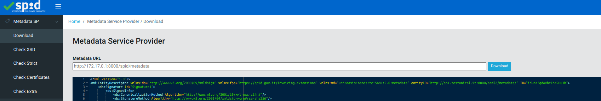
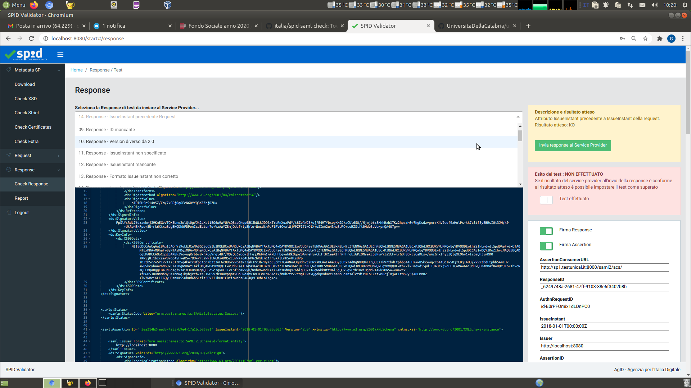

**Per le istruzioni in Italiano, cliccare [qui](README.it.md).**

# *SPID SAML Check*

*SPID SAML Check* is a tool that performs some tests on Service Providers, as inspecting requests shipped to an Identity Provider, checking metadata compliance and sending custom responses back to Service Provider. It includes a tool based on Tox (_`specs-compliance-tests`_) to check the SPID specifications compliance, a Node.js web application (_`spid-validator`_) that provides an easy to use interface and an extension for Google Chrome that intercepts the request.

*SPID SAML Check* has been developed and is maintained by AgID - Agenzia per l'Italia Digitale

## How to build with Docker

```
git clone https://github.com/italia/spid-saml-check.git
cd spid-saml-check
$ docker build -t spid-saml-check .
```

## How to run with Docker

```
$ docker run -t -i -p 8080:8080 spid-saml-check
```

## Usage

- copy spid-saml-check metadata to the SP you want to test with.
  spid-saml-check metadata can be downloaded at: [http://localhost:8080/metadata.xml](http://localhost:8080/metadata.xml)
  ````
  wget http://localhost:8080/metadata.xml -O /path/to/your/sp/metadata/folder/spid-saml-check-metadata.xml
  ````

- start authentication request connecting to your SP, the AuthnRequest would be created and sent to spid-saml-check.
  You should access to a page like shown in the following picture
  

- submit __validator__/ __validator__ as credential
- You would see the SAML2 Authn Request made from your SP
  

- Click on Metadata -> Download and submit your SP metadata url.
  **Warning**: If your SP is on your localhost, please use your host Docker IP and not "localhost"!
  

- Now you'll be able to execute all the tests, in order of appareance: Metadata, Request and Response.
- Select in the scroll menu the test you want to execute, then mark it as done and if successful
  


## How to use it as a *SPID Validator*

The Node.js application, if invoked as a web application *as is*, provides "basic", formal validation of a Service Provider's SAML metadata.

In order to unleash the **full** set of SPID compliance tests (the proper *SPID Validator*), retrieve the metadata of *SPID Validator* at http://localhost:8080/metadata.xml and configure it on as a new Identity Provider (IdP) under your Service Provider (SP) implementation.

When used in this fashion, the *SPID Validator* can be invoked as an IdP from your SP, listing 300+ individual controls, divided into 7 families:
 * 4 families for the formal validation of the SP **metadata** (already described);
 * 3 families for the formal validation of the SP's SAML **request**;
 * 1 family (111 controls) for *interactively* validating the SP behaviour to SAML **response**s from IdP's.

To use the *SPID Validator* the AuthnRequest are thus sent from your SP, loggin in to Validator with following credentials:

   Username: validator

   Password: validator

