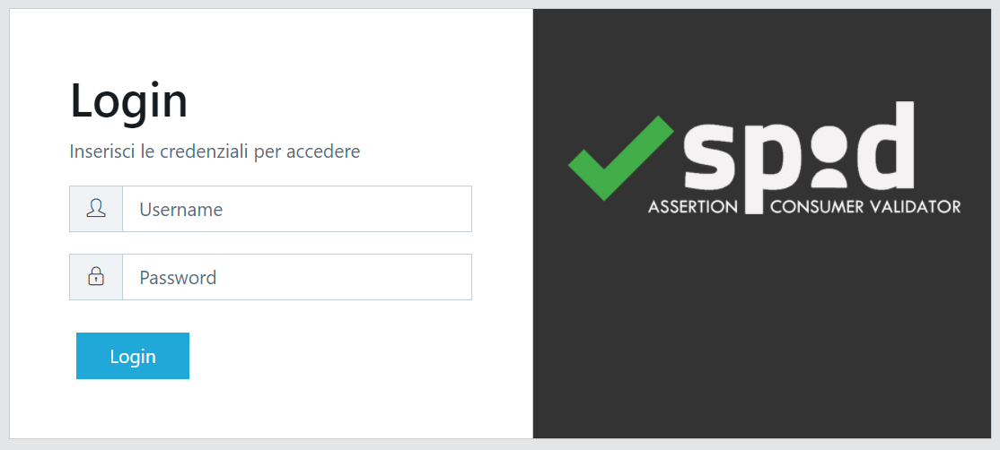
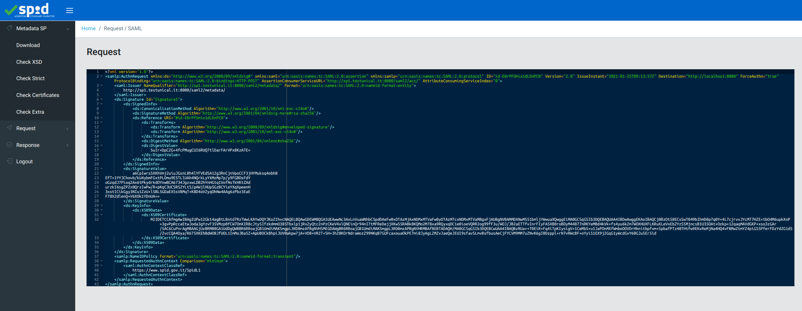
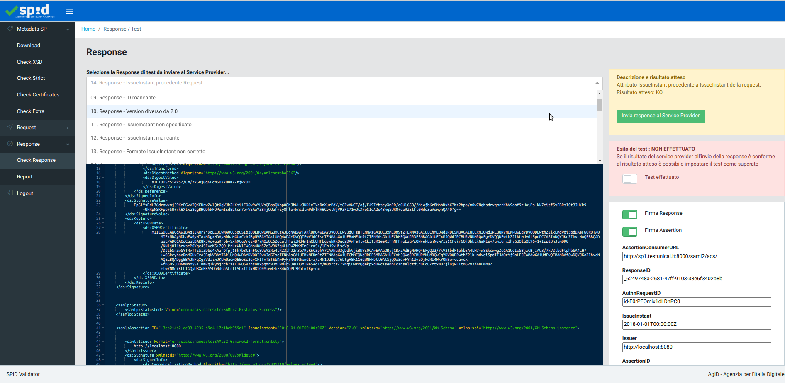
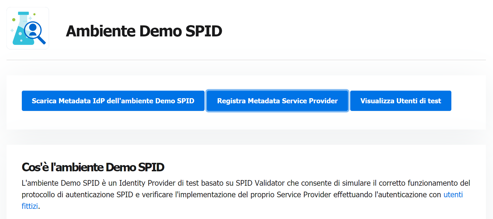
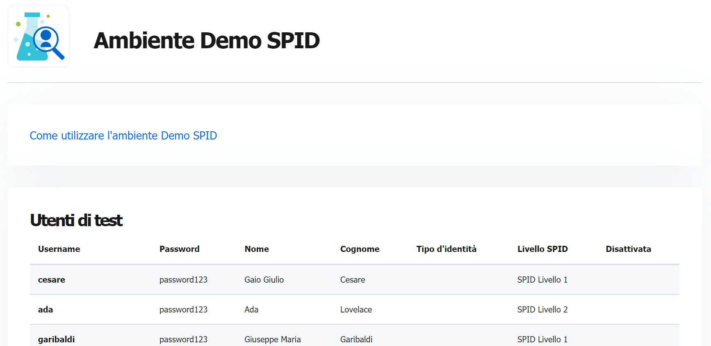
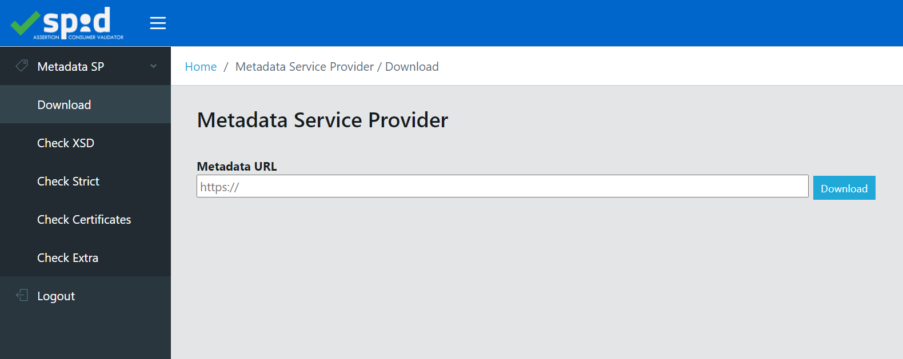
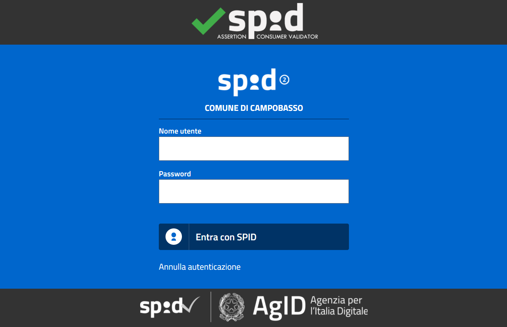

**Per le istruzioni in Italiano, cliccare [qui](README.it.md).**

# *SPID SAML Check*

*SPID SAML Check* is an application suite that provides some tools for Service Providers, useful for inspecting requests shipped to an Identity Provider, checking metadata compliance and sending custom responses back to Service Provider. It includes:
 - [spid-sp-test](https://github.com/italia/spid-sp-test) to check the SPID specifications compliance
 - a web application (_`spid-validator`_) that provides an easy to use interface
 - a web application (_`spid-demo`_) that acts as a test IdP for demo purpose
 - an extension for Google Chrome that intercepts the request (deprecated)

*SPID SAML Check* has been developed and is maintained by [AgID - Agenzia per l'Italia Digitale](https://www.agid.gov.it).

## Quick Start with Docker
The application suite is available as Docker image on DockerHub [italia/spid-saml-check](https://hub.docker.com/r/italia/spid-saml-check).

To start the Docker container use the following command

```
# Executes the last version
docker run -t -i -p 8443:8443 italia/spid-saml-check

# Executes a specific version
docker run -t -i -p 8443:8443 italia/spid-saml-check:v.1.8.2
```

The application spid-validator is immediately available at https://localhost:8443

On the console are printed useful information as:
 - the version of spid-saml-check suite
 - the version of the tool spid-sp-test
 - the command to obtain the shell

Following is an output example you should see from the execution of one of the previous commands

```
> spid-validator@1.0.0 start-prod /spid-saml-check/spid-validator
> node server/spid-validator.js

>>> DATABASE : QUERY
...

Attach to container by this command: docker exec -it 41c81fba9a26 /bin/bash

spid-validator
version: 1.8.1-627d2e7-dirty


listening on port 8443


SPID SP Test Tool (spid-sp-test), version: 0.9.22
```

The images published on DockerHub contains metadata that provides informations about the software versions. To verify these metadata it's possible to execute the command `docker image inspect italia/spid-saml-check:1.8.1` to obtain an output as follows.


```
"Labels": {
  "org.opencontainers.image.authors": "Michele D'Amico, michele.damico@agid.gov.it",
  "org.opencontainers.image.base.name": "italia/spid-saml-check",
  "org.opencontainers.image.created": "2021-10-02T21:03:16Z",
  "org.opencontainers.image.description": "SPID SAML Check è una suita applicativa che fornisce diversi strumenti ai Service Provider SPID, utili per ispezionare le request di autenticazione SAML inviate all'Identity Provider, verificare la correttezza del metadata e inviare response personalizzate al Service Provider.",
  "org.opencontainers.image.licenses": "EUPL-1.2",
  "org.opencontainers.image.revision": "7117b67",
  "org.opencontainers.image.source": "https://github.com/amusarra/spid-saml-check.git",
  "org.opencontainers.image.title": "SPID SAML Check",
  "org.opencontainers.image.url": "https://github.com/italia/spid-saml-check",
  "org.opencontainers.image.vendor": "Developers Italia",
  "org.opencontainers.image.version": "1.8.1"
}

```


## How to build and run with Docker
If you have modified the source code and you want to build your own image, you can do as follows.


```
# 1. Clone repository
git clone https://github.com/italia/spid-saml-check.git

# 2. Edit configurations and certificates

create a private key and a certificate to use for https
 - spid-validator/config/spid-saml-check.key
 - spid-validator/config/spid-saml-check.crt

configure private key and certificate to use for response signing into:
 - spid-validator/config/idp.json
 - spid-validator/config/idp_demo.json

# 3. Build
cd spid-saml-check
docker build -t spid-saml-check .
```

Once the image build process end (it can take time for more minutes), to run the container it's possibile to execute the following command.


```
docker run -t -i -p 8443:8443 spid-saml-check
```

## How to use it as a *SPID Validator*

The application spid-validator, if invoked as a web application *as is*, provides "basic", formal validation of a Service Provider's SAML metadata.

In order to unleash the **full** set of SPID compliance tests (the proper *SPID Validator*), retrieve the metadata of *SPID Validator* at https://localhost:8443/metadata.xml and configure it on as a new Identity Provider (IdP) under your Service Provider (SP) implementation.

When used in this fashion, the *SPID Validator* can be invoked as an IdP from your SP, listing 300+ individual controls, divided into 7 families:
 * 4 families for the formal validation of the SP **metadata** (already described);
 * 3 families for the formal validation of the SP's SAML **request**;
 * 1 family (111 controls) for *interactively* validating the SP behaviour to SAML **response**s from IdP's.

To use the *SPID Validator* the AuthnRequest are thus sent from your SP, loggin in to Validator with credentials __validator__ / __validator__


### Usage steps

- Copy spid-validator metadata to the SP you want to test with.
  spid-validator can be downloaded at: [https://localhost:8443/metadata.xml](https://localhost:8443/metadata.xml)
  ````
  wget https://localhost:8443/metadata.xml -O /path/to/your/sp/metadata/folder/spid-saml-check-metadata.xml
  ````

- Start authentication request connecting to your SP, the AuthnRequest would be created and sent to spid-saml-check.
  You should access to a page like shown in the following picture
  
  
  

- Submit __validator__ / __validator__ as credential
- You would see the SAML2 Authn Request made from your SP

  
  

- Click on Metadata -> Download and submit your SP metadata url.<br/>
  **Warning**: If your SP is on your localhost, please use your host Docker IP and not "localhost"!

  
  
- Now you'll be able to execute all the tests, in order of appareance: Metadata, Request and Response.
- To check a Response, from Response section, select in the scroll menu the test you want to execute, then mark it as done and if successful

  


## How to use it as a *SPID Demo*

The application spid-demo runs at: [https://localhost:8443/demo](https://localhost:8443/demo)


   
   
Test users of spid-demo that can be used are listed at: [https://localhost:8443/demo/users](https://localhost:8443/demo/users)




<h3>Usage steps</h3>

- Copy spid-demo metadata to the SP you want to test with.
  spid-demo metadata can be downloaded at: [https://localhost:8443/demo/metadata.xml](https://localhost:8443/demo/metadata.xml)
  ````
  wget https://localhost:8443/demo/metadata.xml -O /path/to/your/sp/metadata/folder/spid-demo.xml
  ````

- Go to https://localhost:8443 to register metadata of your SP on spid-validator.
  You should access to a page like shown in the following picture
  
  
  
  
- Submit __validator__/ __validator__ as credential

- Click on Metadata -> Download and submit your SP metadata url.<br/>
  **Warning**: If your SP is on your localhost, please use your host Docker IP and not "localhost"!
  
  
  

- Send an authn request to spid-demo in order to use Demo environment

  
